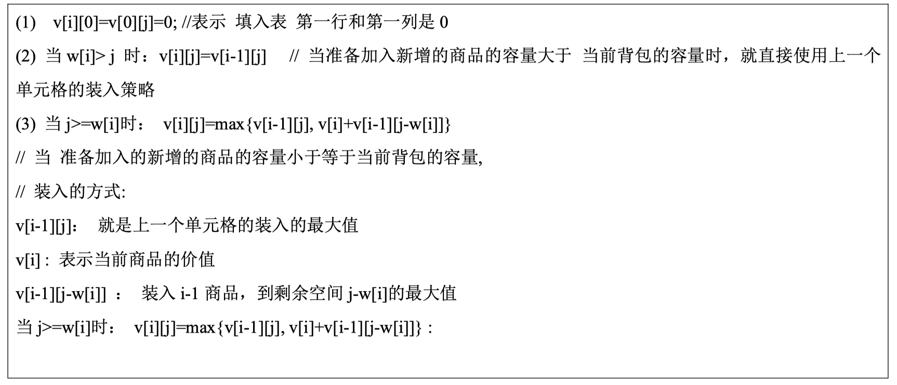
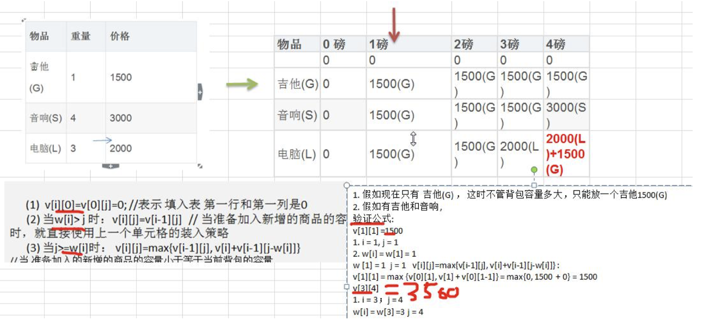

# 第 14 章程序员常用 10 种算法

## 14.1 二分查找算法(非递归)

### 14.1.1 二分查找算法(非递归)介绍

1. 前面我们讲过了二分查找算法，是使用递归的方式，下面我们讲解二分查找算法的非递归方式

2. 二分查找法只适用于从有序的数列中进行查找(比如数字和字母等)，将数列排序后再进行查找

3. 二分查找法的运行时间为对数时间 O(㏒₂n) ，即查找到需要的目标位置最多只需要㏒₂n 步，假设从[0,99]的

队列(100 个数，即 n=100)中寻到目标数 30， 则需要查找步数为㏒₂100 , 即最多需要查找 7 次( 2^6 < 100 < 2^7)

### 14.1.2 二分查找算法(非递归)代码实现

数组 {1,3, 8, 10, 11, 67, 100}, 编程实现二分查找， 要求使用非递归的方式完成.

## 14.2 分治算法

### 14.2.1 分治算法介绍

1. 分治法是一种很重要的算法。字面上的解释是“分而治之”，就是把一个复杂的问题分成两个或更多的相同或 相似的子问题，再把子问题分成更小的子问题……直到最后子问题可以简单的直接求解，原问题的解即子问题 的解的合并。这个技巧是很多高效算法的基础，如排序算法(快速排序，归并排序)，傅立叶变换(快速傅立叶变 换)……

2. 分治算法可以求解的一些经典问题  二分搜索  大整数乘法  棋盘覆盖  合并排序  快速排序  线性时间选择  最接近点对问题  循环赛日程表  汉诺塔

## 14.3 动态规划算法

### 14.3.1 应用场景-背包问题

背包问题：有一个背包，容量为 4 磅 ， 现有如下物品

1. 要求达到的目标为装入的背包的总价值最大，并且重量不超出

2. 要求装入的物品不能重复

### 14.3.2 动态规划算法介绍

1. 动态规划(Dynamic Programming)算法的核心思想是：将大问题划分为小问题进行解决，从而一步步获取最优解 的处理算法

2. 动态规划算法与分治算法类似，其基本思想也是将待求解问题分解成若干个子问题，先求解子问题，然后从这 些子问题的解得到原问题的解。

3. 与分治法不同的是，适合于用动态规划求解的问题，经分解得到子问题往往不是互相独立的。 ( 即下一个子 阶段的求解是建立在上一个子阶段的解的基础上，进行进一步的求解 )

4. 动态规划可以通过填表的方式来逐步推进，得到最优解.

### 14.3.3 动态规划算法最佳实践-背包问题

思路分析和图解

1. 要求达到的目标为装入的背包的总价值最大，并且重量不超出

2. 要求装入的物品不能重复

3. 背包问题主要是指一个给定容量的背包、若干具有一定价值和重量的物品，如何选择物品放入背包使物品的价 值最大。其中又分 01 背包和完全背包(完全背包指的是：每种物品都有无限件可用)

4. 这里的问题属于 01 背包，即每个物品最多放一个。而无限背包可以转化为 01 背包。

5. 算法的主要思想，利用动态规划来解决。每次遍历到的第 i 个物品，根据 w[i]和 v[i]来确定是否需要将该物品 放入背包中。即对于给定的 n 个物品，设 v[i]、w[i]分别为第 i 个物品的价值和重量，C 为背包的容量。再令 v[i][j] 表示在前 i 个物品中能够装入容量为 j 的背包中的最大价值。则我们有下面的结果：

## 14.4 KMP 算法

### 14.4.1 应用场景-字符串匹配问题



字符串匹配问题：：

1. 有一个字符串 str1= ""硅硅谷 尚硅谷你尚硅 尚硅谷你尚硅谷你尚硅你好""，和一个子串 str2="尚硅谷你尚硅 你"

2. 现在要判断 str1 是否含有 str2, 如果存在，就返回第一次出现的位置, 如果没有，则返回-1

### 14.4.2 暴力匹配算法

如果用暴力匹配的思路，并假设现在 str1 匹配到 i 位置，子串 str2 匹配到 j 位置，则有:

1. 如果当前字符匹配成功（即 str1[i] == str2[j]），则 i++，j++，继续匹配下一个字符

2. 如果失配（即 str1[i]! = str2[j]），令 i = i - (j - 1)，j = 0。相当于每次匹配失败时，i 回溯，j 被置为 0。

3. 用暴力方法解决的话就会有大量的回溯，每次只移动一位，若是不匹配，移动到下一位接着判断，浪费了大量 的时间。(不可行!)

4. 暴力匹配算法实现.

### 14.4.3 KMP (Knuth–Morris–Pratt algorithm) 算法介绍

1. KMP 是一个解决模式串在文本串是否出现过，如果出现过，最早出现的位置的经典算法

2. Knuth-Morris-Pratt 字符串查找算法，简称为 “KMP 算法”，常用于在一个文本串 S 内查找一个模式串 P 的 出现位置，这个算法由 Donald Knuth、Vaughan Pratt、James H. Morris 三人于 1977 年联合发表，故取这 3 人的 姓氏命名此算法.

3. KMP 方法算法就利用之前判断过信息，通过一个 next 数组，保存模式串中前后最长公共子序列的长度，每次 回溯时，通过 next 数组找到，前面匹配过的位置，省去了大量的计算时间

4. 参考资料：https://www.cnblogs.com/ZuoAndFutureGirl/p/9028287.html

### 14.4.4 KMP 算法最佳应用-字符串匹配问题

字符串匹配问题：：

1. 有一个字符串 str1= "BBC ABCDAB ABCDABCDABDE"，和一个子串 str2="ABCDABD"

2. 现在要判断 str1 是否含有 str2, 如果存在，就返回第一次出现的位置, 如果没有，则返回-1

3. 要求：使用 KMP 算法完成判断，不能使用简单的暴力匹配算法.