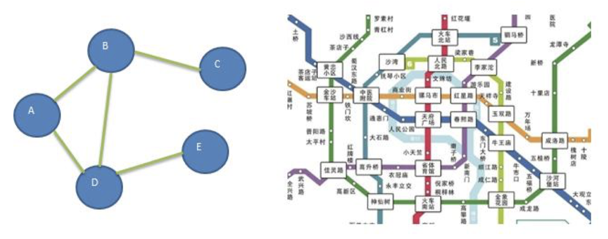
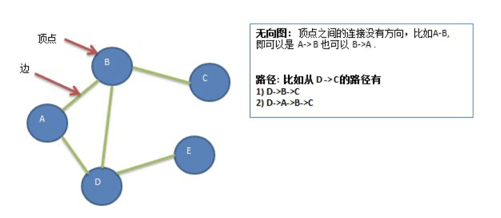
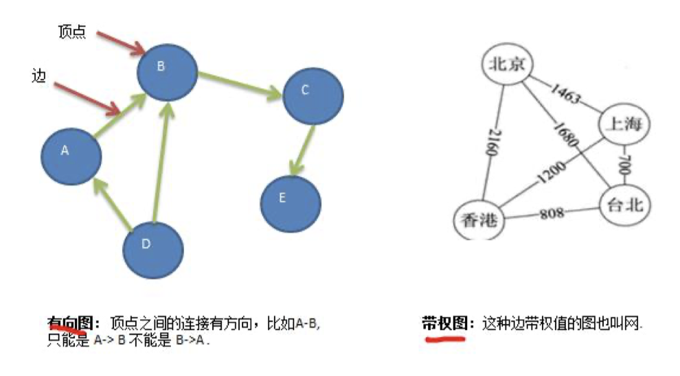
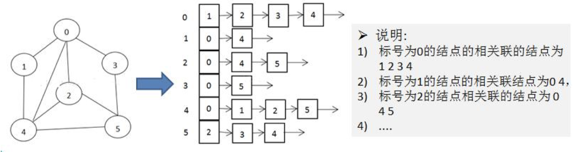
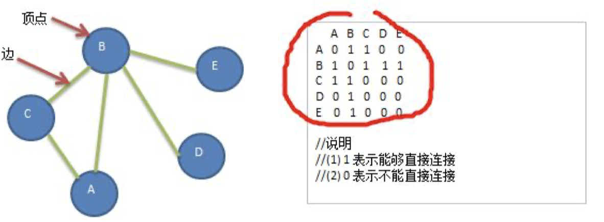
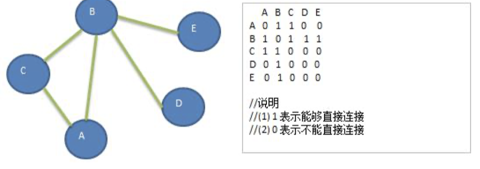
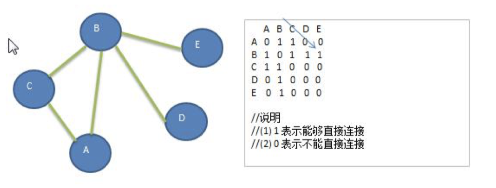
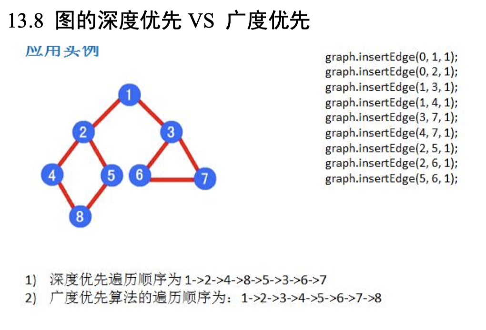

# 第 13 章图

## 13.1 图基本介绍

### 13.1.1 为什么要有图

1. 前面我们学了线性表和树

2. 线性表局限于一个直接前驱和一个直接后继的关系

3. 树也只能有一个直接前驱也就是父节点

4. 当我们需要表示多对多的关系时， 这里我们就用到了图。

### 13.1.2 图的举例说明

图是一种数据结构，其中结点可以具有零个或多个相邻元素。两个结点之间的连接称为边。 结点也可以称为 顶点。如图：

### 13.1.3 图的常用概念

1. 顶点(vertex)

2. 边(edge)

3. 路径

4. 无向图(右图

5. 有向图

6. 带权图

## 13.2 图的表示方式

图的表示方式有两种：二维数组表示（邻接矩阵）；链表表示（邻接表）。

### 13.2.1 邻接矩阵

邻接矩阵是表示图形中顶点之间相邻关系的矩阵，对于 n 个顶点的图而言，矩阵是的 row 和 col 表示的是 1....n 个点。

### 13.2.2 邻接表

1. 邻接矩阵需要为每个顶点都分配 n 个边的空间，其实有很多边都是不存在,会造成空间的一定损失.

2. 邻接表的实现只关心存在的边，不关心不存在的边。因此没有空间浪费，邻接表由数组+链表组成

3. 举例说明

## 13.3 图的快速入门案例

1. 要求: 代码实现如下图结构.

2. 思路分析 (1) 存储顶点 String 使用 ArrayList (2) 保存矩阵 int[][] edges

## 13.4 图的深度优先遍历介绍

### 13.4.1 图遍历介绍

所谓图的遍历，即是对结点的访问。一个图有那么多个结点，如何遍历这些结点，需要特定策略，一般有两种 访问策略: (1)深度优先遍历 (2)广度优先遍历

### 13.4.2 深度优先遍历基本思想

1. 图的深度优先搜索(Depth First Search) 。 深度优先遍历，从初始访问结点出发，初始访问结点可能有多个邻接结点，深度优先遍历的策略就是首先访问 第一个邻接结点，然后再以这个被访问的邻接结点作为初始结点，访问它的第一个邻接结点， 可以这样理解： 每次都在访问完当前结点后首先访问当前结点的第一个邻接结点。

2. 我们可以看到，这样的访问策略是优先往纵向挖掘深入，而不是对一个结点的所有邻接结点进行横向访问。

3. 显然，深度优先搜索是一个递归的过程

### 13.4.3 深度优先遍历算法步骤

1. 访问初始结点 v， 并标记结点 v 为已访问。

2. 查找结点 v 的第一个邻接结点 w。

3. 若 w 存在，则继续执行 4， 如果 w 不存在，则回到第 1 步，将从 v 的下一个结点继续。

4. 若 w 未被访问，对 w 进行深度优先遍历递归（即把 w 当做另一个 v， 然后进行步骤 123）。

5. 查找结点 v 的 w 邻接结点的下一个邻接结点，转到步骤 3。

6. 分析图

## 13.5 图的广度优先遍历

### 13.5.1 广度优先遍历基本思想

1. 图的广度优先搜索(Broad First Search) 。

2. 类似于一个分层搜索的过程，广度优先遍历需要使用一个队列以保持访问过的结点的顺序，以便按这个顺序来 访问这些结点的邻接结点

### 13.5.2 广度优先遍历算法步骤

1. 访问初始结点 v 并标记结点 v 为已访问。

2. 结点 v 入队列

3. 当队列非空时，继续执行，否则算法结束。

4. 出队列，取得队头结点 u。

5. 查找结点 u 的第一个邻接结点 w。

6. 若结点 u 的邻接结点 w 不存在，则转到步骤 3；否则循环执行以下三个步骤：

    1. 若结点 w 尚未被访问，则访问结点 w 并标记为已访问。

    2. 结点 w 入队列

    3. 查找结点 u 的继 w 邻接结点后的下一个邻接结点 w，转到步骤 6。

### 13.5.3 广度优先算法的图示

