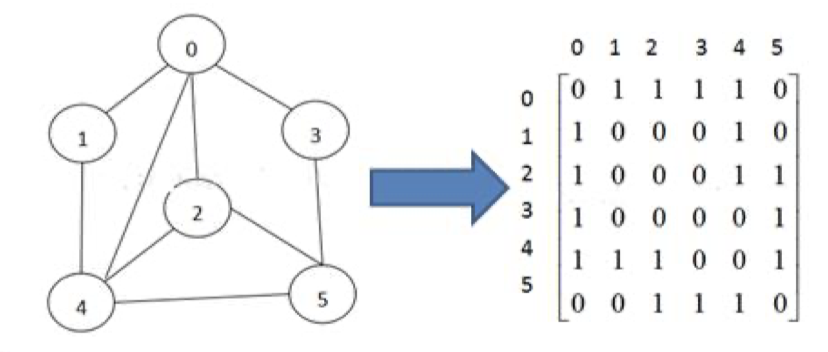

# 第 13 章图

## 13.1 图基本介绍

### 13.1.1 为什么要有图

1. 前面我们学了线性表和树

2. 线性表局限于一个直接前驱和一个直接后继的关系

3. 树也只能有一个直接前驱也就是父节点

4. 当我们需要表示多对多的关系时， 这里我们就用到了图。

### 13.1.2 图的举例说明

图是一种数据结构，其中结点可以具有零个或多个相邻元素。两个结点之间的连接称为边。 结点也可以称为 顶点。如图：

### 13.1.3 图的常用概念

1. 顶点(vertex)

2. 边(edge)

3. 路径

4. 无向图(右图

5. 有向图

6. 带权图

## 13.2 图的表示方式

图的表示方式有两种：二维数组表示（邻接矩阵）；链表表示（邻接表）。

### 13.2.1 邻接矩阵

邻接矩阵是表示图形中顶点之间相邻关系的矩阵，对于 n 个顶点的图而言，矩阵是的 row 和 col 表示的是 1....n 个点。

### 13.2.2 邻接表

1. 邻接矩阵需要为每个顶点都分配 n 个边的空间，其实有很多边都是不存在,会造成空间的一定损失.

2. 邻接表的实现只关心存在的边，不关心不存在的边。因此没有空间浪费，邻接表由数组+链表组成

3. 举例说明

## 13.3 图的快速入门案例

1. 要求: 代码实现如下图结构.

2. 思路分析 (1) 存储顶点 String 使用 ArrayList (2) 保存矩阵 int[][] edges

