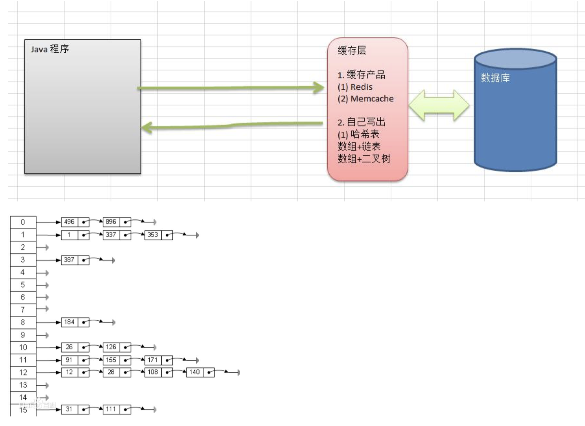
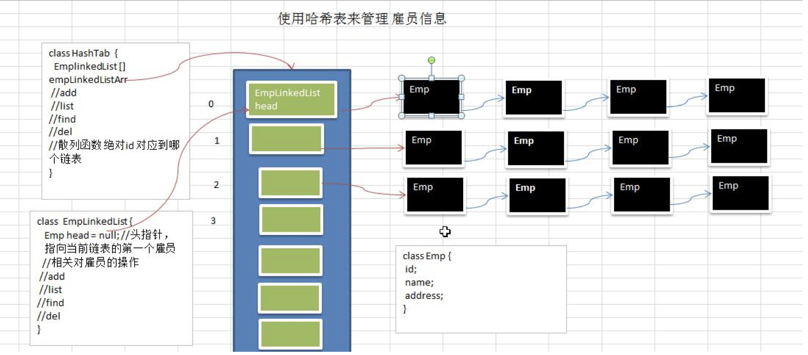

# 哈希表 (Hashtable)

## 哈希表(散列)-Google 上机题

1. 看一个实际需求，google 公司的一个上机题:

2. 有一个公司,当有新的员工来报道时,要求将该员工的信息加入(id,性别,年龄,住址..),当输入该员工的 id 时,要求查 找到该员工的 所有信息.

3. 要求: 不使用数据库,尽量节省内存,速度越快越好=>哈希表(散列)

## 哈希表的基本介绍

散列表（Hash table，也叫哈希表），是根据关键码值(Key value)而直接进行访问的数据结构。也就是说，它通 过把关键码值映射到表中一个位置来访问记录，以加快查找的速度。这个映射函数叫做散列函数，存放记录的数组 叫做散列表。

## google 公司的一个上机题:

有一个公司,当有新的员工来报道时,要求将该员工的信息加入(id,性别,年龄,名字,住址..),当输入该员工的 id 时, 要求查找到该员工的 所有信息.

要求:

1. 不使用数据库,,速度越快越好=>哈希表(散列)

2. 添加时，保证按照 id 从低到高插入 [课后思考：如果 id 不是从低到高插入，但要求各条链表仍是从低到 高，怎么解决?]

3. 使用链表来实现哈希表, 该链表不带表头[即: 链表的第一个结点就存放雇员信息]

4. 思路分析并画出示意图

