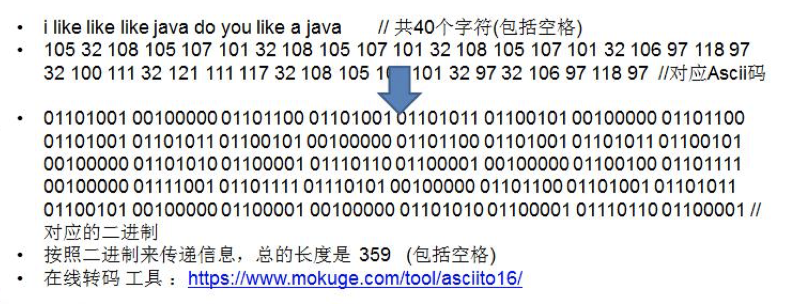
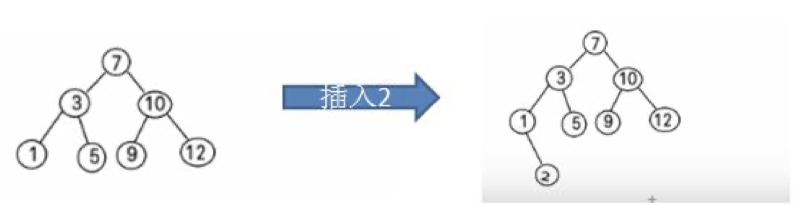

# 第 11 章树结构实际应用

## 堆排序 (heapSort)

### 堆排序基本介绍

1. 堆排序是利用堆这种数据结构而设计的一种排序算法，堆排序是一种选择排序，它的最坏，最好，平均时间复 杂度均为 O(nlogn)，它也是不稳定排序。

2. 堆是具有以下性质的完全二叉树：每个结点的值都大于或等于其左右孩子结点的值，称为大顶堆, 注意 : 没有 要求结点的左孩子的值和右孩子的值的大小关系。

3. 每个结点的值都小于或等于其左右孩子结点的值，称为小顶堆

4. 大顶堆举例说明

5. 小顶堆举例说明

6. 一般升序采用大顶堆，降序采用小顶堆

### 堆排序基本思想

堆排序的基本思想是：

1. 将待排序序列构造成一个大顶堆

2. 此时，整个序列的最大值就是堆顶的根节点。

3. 将其与末尾元素进行交换，此时末尾就为最大值。

4. 然后将剩余 n-1 个元素重新构造成一个堆，这样会得到 n 个元素的次小值。如此反复执行，便能得到一个有序 序列了。

可以看到在构建大顶堆的过程中，元素的个数逐渐减少，最后就得到一个有序序列了.

### 堆排序步骤图解说明

> 要求：给你一个数组 {4,6,8,5,9} , 要求使用堆排序法，将数组升序排序。

### 步骤一 构造初始堆。将给定无序序列构造成一个大顶堆（一般升序采用大顶堆，降序采用小顶堆)。

### 原始的数组 [4, 6, 8, 5, 9]

1. 假设给定无序序列结构如

2. 此时我们从最后一个非叶子结点开始（叶结点自然不用调整，第一个非叶子结点 arr.length/2-1=5/2-1=1，也就是下面的 6 结点），从左至右，从下至上进行调整。

3. 找到第二个非叶节点 4，由于[4,9,8]中 9 元素最大，4 和 9 交换。

4. 这时，交换导致了子根[4,5,6]结构混乱，继续调整，[4,5,6]中 6 最大，交换 4 和 6。

此时，我们就将一个无序序列构造成了一个大顶堆。
### 步骤二 将堆顶元素与末尾元素进行交换，使末尾元素最大。然后继续调整堆，再将堆顶元素与末尾元素交换，得到第二大元素。如此反复进行交换、重建、交换。

1. 将堆顶元素 9 和末尾元素 4 进行交换

2. 重新调整结构，使其继续满足堆定义

3. 再将堆顶元素 8 与末尾元素 5 进行交换，得到第二大元素 8.

4. 后续过程，继续进行调整，交换，如此反复进行，最终使得整个序列有序

### 再简单总结下堆排序的基本思路：

1. 将无序序列构建成一个堆，根据升序降序需求选择大顶堆或小顶堆;

2. 将堆顶元素与末尾元素交换，将最大元素"沉"到数组末端;

3. 重新调整结构，使其满足堆定义，然后继续交换堆顶元素与当前末尾元素，反复执行调整+交换步骤，直到整个序列有序。

## 赫夫曼树 (Huffman Tree)

### 基本介绍

1. 给定 n 个权值作为 n 个叶子结点，构造一棵二叉树，若该树的带权路径长度(wpl)达到最小，称这样的二叉树为 最优二叉树，也称为哈夫曼树(Huffman Tree), 还有的书翻译为霍夫曼树。

2. 赫夫曼树是带权路径长度最短的树，权值较大的结点离根较近

### 赫夫曼树几个重要概念和举例说明

1. 路径和路径长度：在一棵树中，从一个结点往下可以达到的孩子或孙子结点之间的通路，称为路径。通路中分支的数目称为路径长度。若规定根结点的层数为 1，则从根结点到第 L 层结点的路径长度为 L-1
                                                 
2. 结点的权及带权路径长度：若将树中结点赋给一个有着某种含义的数值，则这个数值称为该结点的权。结 点的带权路径长度为：从根结点到该结点之间的路径长度与该结点的权的乘积
                                                 
3. 树的带权路径长度：树的带权路径长度规定为所有叶子结点的带权路径长度之和，记为 WPL(weighted path length) ,权值越大的结点离根结点越近的二叉树才是最优二叉树。

4. WPL 最小的就是赫夫曼树

### 赫夫曼树创建思路图解

给你一个数列 {13, 7, 8, 3, 29, 6, 1}，要求转成一颗赫夫曼树.

> 思路分析(示意图)： {13, 7, 8, 3, 29, 6, 1}

### 构成赫夫曼树的步骤：

1. 从小到大进行排序, 将每一个数据，每个数据都是一个节点 ， 每个节点可以看成是一颗最简单的二叉树

2. 取出根节点权值最小的两颗二叉树

3. 组成一颗新的二叉树, 该新的二叉树的根节点的权值是前面两颗二叉树根节点权值的和

4. 再将这颗新的二叉树，以根节点的权值大小 再次排序， 不断重复 据都被处理，就得到一颗赫夫曼树

5. 图解:

## 赫夫曼编码

### 基本介绍

1. 赫夫曼编码也翻译为 哈夫曼编码(Huffman Coding)，又称霍夫曼编码，是一种编码方式, 属于一种程序算法

2. 赫夫曼编码是赫哈夫曼树在电讯通信中的经典的应用之一。

3. 赫夫曼编码广泛地用于数据文件压缩。其压缩率通常在 20%～90%之间

4. 赫夫曼码是可变字长编码(VLC)的一种。Huffman 于 1952 年提出一种编码方法，称之为最佳编码

### 原理剖析

通信领域中信息的处理方式 1-定长编码

通信领域中信息的处理方式 2-变长编码

通信领域中信息的处理方式 3-赫夫曼编码

## 步骤如下;

### 传输的 字符串

1. i like like like java do you like a java

2. d:1 y:1 u:1 j:2 v:2 o:2 l:4 k:4 e:4 i:5 a:5 :9 // 各个字符对应的个数

3. 按照上面字符出现的次数构建一颗赫夫曼树, 次数作为权值 步骤：

    > #### 构成赫夫曼树的步骤：
    > 1. 从小到大进行排序, 将每一个数据，每个数据都是一个节点 ， 每个节点可以看成是一颗最简单的二叉树
    > 2. 取出根节点权值最小的两颗二叉树
    > 3. 组成一颗新的二叉树, 该新的二叉树的根节点的权值是前面两颗二叉树根节点权值的和
    > 4. 再将这颗新的二叉树，以根节点的权值大小 再次排序， 不断重复 1-2-3-4 的步骤，直到数列中，所有的数据都被处理， 就得到一颗赫夫曼树

    

4. 根据赫夫曼树，给各个字符,规定编码 (前缀编码)， 向左的路径为 0 向右的路径为 1 ， 编码 如下:

    > o: 1000 u: 10010 d: 100110 y: 100111 i: 101 a : 110 k: 1110 e: 1111 j: 0000 v: 0001 l: 001 : 01
    
5. 按照上面的赫夫曼编码，我们的"i like like like java do you like a java"
    > 字符串对应的编码为 (注意这里我们使用的无损压缩)
    > 10101001101111011110100110111101111010011011110111101000011000011100110011110000110 01111000100100100110111101111011100100001100001110 通过赫夫曼编码处理 长度为 133
    
6. 长度为 ： 133
    > 原来长度是 359 , 压缩了 (359-133) / 359 = 62.9%

>此编码满足前缀编码, 即字符的编码都不能是其他字符编码的前缀。不会造成匹配的多义性 赫夫曼编码是无损处理方案

## 注意事项
注意, 这个赫夫曼树根据排序方法不同，也可能不太一样，这样对应的赫夫曼编码也不完全一样，但是 wpl 是 一样的，都是最小的, 最后生成的赫夫曼编码的长度是一样，比如: 如果我们让每次生成的新的二叉树总是排在权 值相同的二叉树的最后一个，则生成的二叉树为:

最佳实践-数据压缩(创建赫夫曼树)

将给出的一段文本，比如 "i like like like java do you like a java" ， 根据前面的讲的赫夫曼编码原理，对其进行数 据 压 缩 处 理 ，
形 式 如
   > "1010100110111101111010011011110111101001101111011110100001100001110011001111000011001111000100100100 110111101111011100100001100001110"
   
### 最佳实践-数据压缩(生成赫夫曼编码和赫夫曼编码后的数据)

我们已经生成了 赫夫曼树, 下面我们继续完成任务
1. 生成赫夫曼树对应的赫夫曼编码 , 如下表:
    > =01 a=100 d=11000 u=11001 e=1110 v=11011 i=101 y=11010 j=0010 k=1111 l=000 o=0011

2. 使用赫夫曼编码来生成赫夫曼编码数据 字符串生成对应的编码数据, 形式如下. 
    > 10101000101111111100100010111111110010001011111111001001010011011100011100000110111010001111001010 00101111111100110001001010011011100
    ,即按照上面的赫夫曼编码， 将"i like like like java do you like a java"

3. 思路：前面已经分析过了，而且我们讲过了生成赫夫曼编码的具体实现。

## 二叉排序树

### 11.4.1 先看一个需求

给你一个数列 (7, 3, 10, 12, 5, 1, 9)， 要求能够高效的完成对数据的查询和添加

### 11.4.2 解决方案分析

使用数组 数组未排序， 优点：直接在数组尾添加，速度快。 缺点：查找速度慢. [示意图] 数组排序，优点：可以使用二分查找，查找速度快，缺点：为了保证数组有序，在添加新数据时，找到插入位 置后，后面的数据需整体移动，速度慢。[示意图]

使用链式存储-链表 不管链表是否有序，查找速度都慢，添加数据速度比数组快，不需要数据整体移动。[示意图]

使用二叉排序树

### 11.4.3 二叉排序树介绍 (Binary Sort(Search) Tree)

二叉排序树：BST: (Binary Sort(Search) Tree), 对于二叉排序树的任何一个非叶子节点，要求左子节点的值比当 前节点的值小，右子节点的值比当前节点的值大。 特别说明：如果有相同的值，可以将该节点放在左子节点或右子节点

比如针对前面的数据 (7, 3, 10, 12, 5, 1, 9) ，对应的二叉排序树为：

### 11.4.4 二叉排序树创建和遍历

一个数组创建成对应的二叉排序树，并使用中序遍历二叉排序树，比如: 数组为 Array(7, 3, 10, 12, 5, 1, 9) ， 创 建成对应的二叉排序树为 :

### 11.4.5 二叉排序树的删除

二叉排序树的删除情况比较复杂，有下面三种情况需要考虑

1. 删除叶子节点 (比如：2, 5, 9, 12)

2. 删除只有一颗子树的节点 (比如：1)

3. 删除有两颗子树的节点. (比如：7, 3，10 )

4. 操作的思路分析

//对删除结点的各种情况的思路分析:

##### 第一种情况:

> 删除叶子节点 (比如：2, 5, 9, 12) 思路
> 1. 需求先去找到要删除的结点 targetNode
> 2. 找到 targetNode 的 父结点 parent
> 3. 确定 targetNode 是 parent 的左子结点 还是右子结点
> 4. 根据前面的情况来对应删除 左子结点 parent.left = null 右子结点 parent.right = null;

#### 第二种情况: 删除只有一颗子树的节点 比如 1 思路

> 1. 需求先去找到要删除的结点 targetNode
> 2. 找到 targetNode 的 父结点 parent
> 3. 确定 targetNode 的子结点是左子结点还是右子结点
> 4. targetNode 是 parent 的左子结点还是右子结点
> 5. 如果 targetNode 有左子结点
>   1. 如果 targetNode 是 parent 的左子结点
>   parent.left = targetNode.left;
>   2. 如果 targetNode 是 parent 的右子结点 parent.right = targetNode.left;
> 6. 如果 targetNode 有右子结点
>   1. 如果 targetNode 是 parent 的左子结点 parent.left = targetNode.right;
>   2. 如果 targetNode 是 parent 的右子结点 parent.right = targetNode.right

#### 情况三 ： 删除有两颗子树的节点. (比如：7, 3，10 ) 思路

> 1. 需求先去找到要删除的结点 targetNode
> 2. 找到 targetNode 的 父结点 parent
> 3. 从 targetNode 的右子树找到最小的结点
> 4. 用一个临时变量，将 最小结点的值保存 temp = 11
> 5. 删除该最小结点
> 6. targetNode.value = temp

## 11.5 平衡二叉树(AVL 树)

### 11.5.1 看一个案例(说明二叉排序树可能的问题)

> 给你一个数列{1,2,3,4,5,6}，要求创建一颗二叉排序树(BST), 并分析问题所在.  左边 BST 存在的问题分析:

1. 左子树全部为空，从形式上看，更像一个单链表.

2. 插入速度没有影响

3. 查询速度明显降低(因为需要依次比较), 不能发挥 BST的优势，因为每次还需要比较左子树，其查询速度比 单链表还慢
4. 解决方案-平衡二叉树(AVL)

### 11.5.2 基本介绍

1. 平衡二叉树也叫平衡二叉搜索树（Self-balancing binary search tree）又被称为 AVL 树， 可以保证查询效率较高。

2. 具有以下特点：它是一 棵空树或它的左右两个子树的高度差的绝对值不超过 1，并且左右两个子树都是一棵 平衡二叉树。平衡二叉树的常用实现方法有红黑树、AVL、替罪羊树、Treap、伸展树等。

3. 举例说明, 看看下面哪些 AVL 树, 为什么?

### 11.5.3 应用案例-单旋转(左旋转)

1. 要求: 给你一个数列，创建出对应的平衡二叉树.数列 {4,3,6,5,7,8}

2. 思路分析(示意图)

### 11.5.4 应用案例-单旋转(右旋转)

1. 要求: 给你一个数列，创建出对应的平衡二叉树.数列 {10,12, 8, 9, 7, 6}

2. 思路分析(示意图)

### 11.5.5 应用案例-双旋转

前面的两个数列，进行单旋转(即一次旋转)就可以将非平衡二叉树转成平衡二叉树,但是在某些情况下，单旋转 不能完成平衡二叉树的转换。比如数列 int[] arr = { 10, 11, 7, 6, 8, 9 }; 运行原来的代码可以看到，并没有转成 AVL 树.

int[] arr = {2,1,6,5,7,3}; // 运行原来的代码可以看到，并没有转成 AVL 树

解决思路分析

1. 当符号右旋转的条件时

2. 如果它的左子树的右子树高度大于它的左子树的高度

3. 先对当前这个结点的左节点进行左旋转

4. 在对当前结点进行右旋转的操作即可