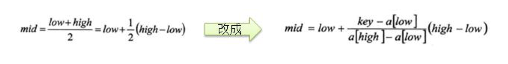
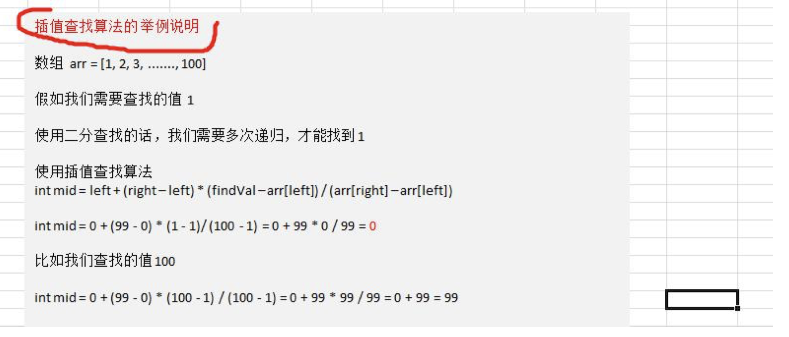

# 查找算法

## 查找算法介绍

在 java 中，我们常用的查找有四种:

1) 顺序(线性)查找

2) 二分查找/折半查找

3) 插值查找

4) 斐波那契查找

## 线性查找算法

> 有一个数列： {1,8, 10, 89, 1000, 1234} ，判断数列中是否包含此名称【顺序查找】 要求: 如果找到了，就提 示找到，并给出下标值。

## 二分查找算法

### 二分查找：

请对一个有序数组进行二分查找{1,8, 10, 89, 1000, 1234} ，输入一个数看看该数组是否存在此数，并且求出下
标，如果没有就提示"没有这个数"。

### 二分查找算法的思路

### 插值查找算法

1. 插值查找原理介绍:
    插值查找算法类似于二分查找，不同的是插值查找每次从自适应 mid 处开始查找。
2. 将折半查找中的求 mid 索引的公式 , low 表示左边索引 left, high 表示右边索引 right.
    key 就是前面我们讲的 findVal

    

3. int mid = low + (high - low) * (key - arr[low]) / (arr[high] - arr[low]) 对应前面的代码公式： int mid = left + (right – 
    left) * (findVal – arr[left]) / (arr[right] – arr[left]);/*插值索引*/

4. 举例说明插值查找算法 1-100 的数组
    
    
### 插值查找应用案例：

请对一个有序数组进行插值查找 {1,8, 10, 89, 1000, 1234} ，输入一个数看看该数组是否存在此数，并且求出下 标，如果没有就提示"没有这个数"。

### 插值查找注意事项：

1. 对于数据量较大，关键字分布比较均匀的查找表来说，采用插值查找, 速度较快.

2. 关键字分布不均匀的情况下，该方法不一定比折半查找要好