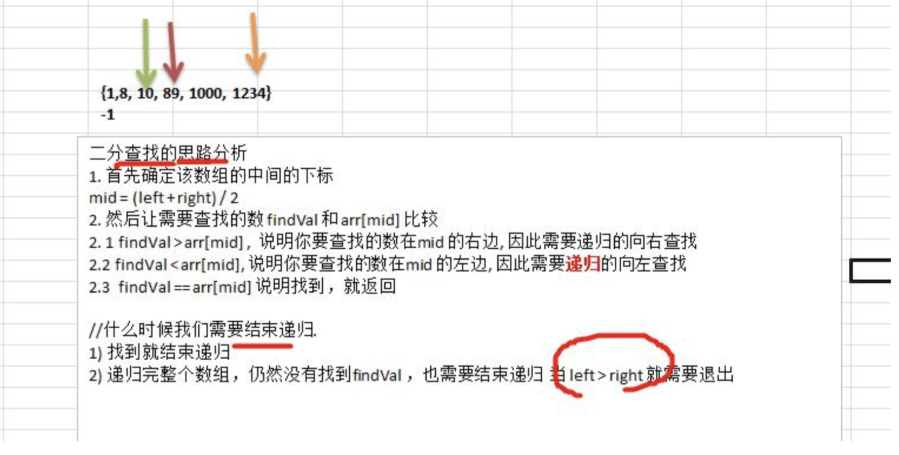

# 查找算法

## 查找算法介绍

在 java 中，我们常用的查找有四种:

1) 顺序(线性)查找

2) 二分查找/折半查找

3) 插值查找

4) 斐波那契查找

## 线性查找算法

> 有一个数列： {1,8, 10, 89, 1000, 1234} ，判断数列中是否包含此名称【顺序查找】 要求: 如果找到了，就提 示找到，并给出下标值。

## 二分查找算法

### 二分查找：

请对一个有序数组进行二分查找{1,8, 10, 89, 1000, 1234} ，输入一个数看看该数组是否存在此数，并且求出下
标，如果没有就提示"没有这个数"。

### 二分查找算法的思路

