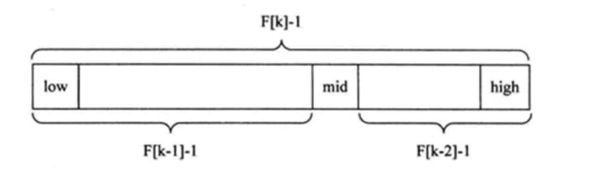

# 查找算法

## 查找算法介绍

在 java 中，我们常用的查找有四种:

1) 顺序(线性)查找

2) 二分查找/折半查找

3) 插值查找

4) 斐波那契查找

## 线性查找算法

> 有一个数列： {1,8, 10, 89, 1000, 1234} ，判断数列中是否包含此名称【顺序查找】 要求: 如果找到了，就提 示找到，并给出下标值。

## 二分查找算法

### 二分查找：

请对一个有序数组进行二分查找{1,8, 10, 89, 1000, 1234} ，输入一个数看看该数组是否存在此数，并且求出下
标，如果没有就提示"没有这个数"。

### 二分查找算法的思路

### 插值查找算法

1. 插值查找原理介绍:
    插值查找算法类似于二分查找，不同的是插值查找每次从自适应 mid 处开始查找。
2. 将折半查找中的求 mid 索引的公式 , low 表示左边索引 left, high 表示右边索引 right.
    key 就是前面我们讲的 findVal

    

3. int mid = low + (high - low) * (key - arr[low]) / (arr[high] - arr[low]) 对应前面的代码公式： int mid = left + (right – 
    left) * (findVal – arr[left]) / (arr[right] – arr[left]);/*插值索引*/

4. 举例说明插值查找算法 1-100 的数组
    
    
### 插值查找应用案例：

请对一个有序数组进行插值查找 {1,8, 10, 89, 1000, 1234} ，输入一个数看看该数组是否存在此数，并且求出下 标，如果没有就提示"没有这个数"。

### 插值查找注意事项：

1. 对于数据量较大，关键字分布比较均匀的查找表来说，采用插值查找, 速度较快.

2. 关键字分布不均匀的情况下，该方法不一定比折半查找要好

## 斐波那契(黄金分割法)查找算法 (Fibonacci Search)

### 斐波那契(黄金分割法)查找基本介绍:

1. 黄金分割点是指把一条线段分割为两部分，使其中一部分与全长之比等于另一部分与这部分之比。取其前三位 数字的近似值是 0.618。由于按此比例设计的造型十分美丽，因此称为黄金分割，也称为中外比。这是一个神 奇的数字，会带来意向不大的效果。

2. 斐波那契数列 {1, 1, 2, 3, 5, 8, 13, 21, 34, 55 } 发现斐波那契数列的两个相邻数 的比例，无限接近 黄金分割值0.618
### 斐波那契(黄金分割法)原理:

斐波那契查找原理与前两种相似，仅仅改变了中间结点（mid）的位置，mid 不再是中间或插值得到，而是位 于黄金分割点附近，即 mid=low+F(k-1)-1（F 代表斐波那契数列），如下图所示
    
    
> 对 F(k-1)-1 的理解：
> 1. 由斐波那契数列 F[k]=F[k-1]+F[k-2] 的性质，可以得到 （F[k]-1）=（F[k-1]-1）+（F[k-2]-1）+1 。该式说明： 只要顺序表的长度为 F[k]-1，则可以将该表分成长度为 F[k-1]-1 和 F[k-2]-1 的两段，即如上图所示。从而中间位置为 mid=low+F(k-1)-1
> 2. 类似的，每一子段也可以用相同的方式分割
> 3. 但顺序表长度 n 不一定刚好等于 F[k]-1，所以需要将原来的顺序表长度 n 增加至 F[k]-1。这里的 k 值只要能使 得 F[k]-1 恰好大于或等于 n 即可，由以下代码得到,顺序表长度增加后，新增的位置（从 n+1 到 F[k]-1 位置）， 都赋为 n 位置的值即可。 while(n>fib(k)-1) k++;

### 斐波那契查找应用案例：

请对一个有序数组进行斐波那契查找 {1,8, 10, 89, 1000, 1234} ，输入一个数看看该数组是否存在此数，并且求 出下标，如果没有就提示"没有这个数"。