# 树结构的基础部分

## 二叉树

### 为什么需要树这种数据结构

#### 1. 数组存储方式的分析
   > 优点：通过下标方式访问元素，速度快。对于有序数组，还可使用二分查找提高检索速度。 缺点：如果要检索具体某个值，或者插入值(按一定顺序)会整体移动，效率较低 [示意图] 画出操作示意图：

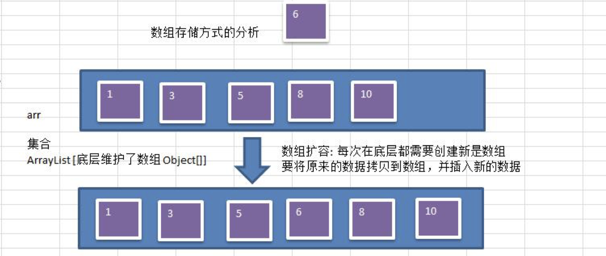

#### 2. 链式存储方式的分析
   > 优点：在一定程度上对数组存储方式有优化(比如：插入一个数值节点，只需要将插入节点，链接到链表中即可， 删除效率也很好)。 缺点：在进行检索时，效率仍然较低，比如(检索某个值，需要从头节点开始遍历) 【示意图】 操作示意图：
   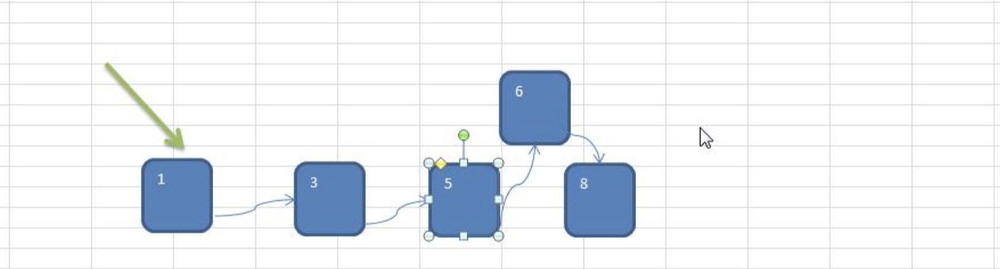

#### 3. 树存储方式的分析

能提高数据存储，读取的效率, 比如利用 二叉排序树(Binary Sort Tree)，既可以保证数据的检索速度，同时也 可以保证数据的插入，删除，修改的速度。【示意图,后面详讲】 案例: [7, 3, 10, 1, 5, 9, 12]
    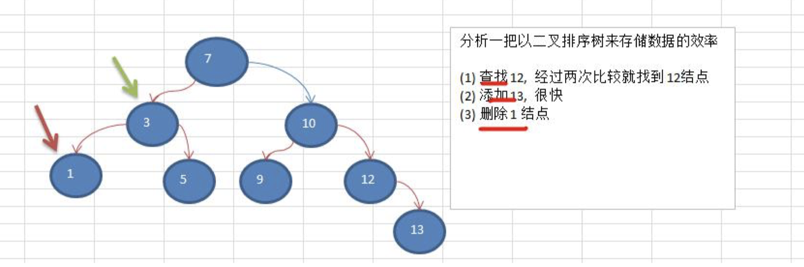
    
### 树示意图
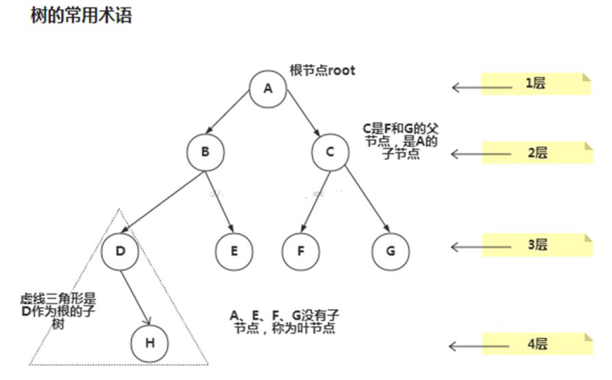

### 树的常用术语(结合示意图理解):

> 1. 节点
> 2. 根节点
> 3. 父节点
> 4. 子节点
> 5. 叶子节点 (没有子节点的节点)
> 6. 节点的权(节点值)
> 7. 路径(从 root 节点找到该节点的路线)
> 8. 层
> 9. 子树
> 10. 树的高度(最大层数)
> 11. 森林 :多颗子树构成森林

### 二叉树的概念

1. 树有很多种，每个节点最多只能有两个子节点的一种形式称为二叉树。

2. 二叉树的子节点分为左节点和右节点

3. 示意图
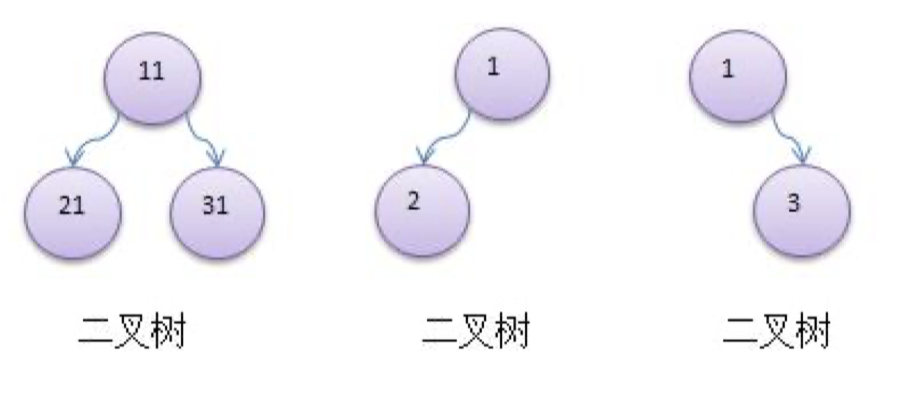

4. 如果该二叉树的所有叶子节点都在最后一层，并且结点总数= 2^n -1 , n 为层数，则我们称为满二叉树。
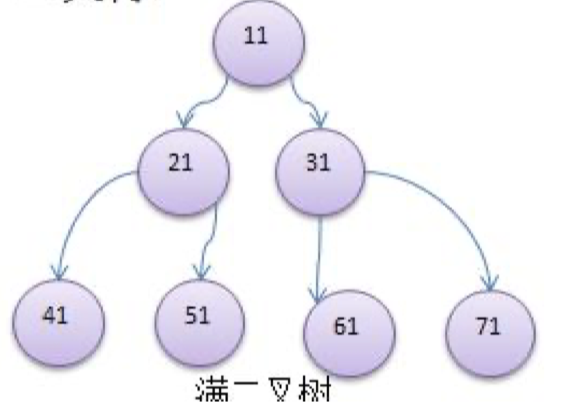

5. 如果该二叉树的所有叶子节点都在最后一层或者倒数第二层，而且最后一层的叶子节点在左边连续，倒数第二 层的叶子节点在右边连续，我们称为完全二叉树
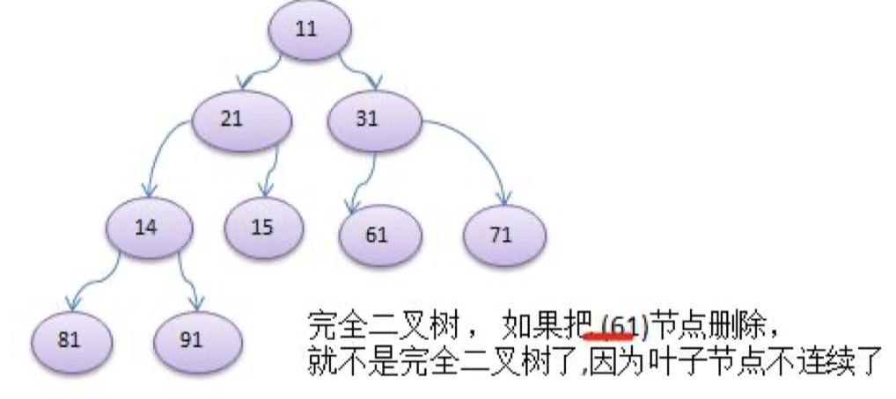

二叉树遍历的说明

### 使用前序，中序和后序对下面的二叉树进行遍历.

1. 前序遍历: 先输出父节点，再遍历左子树和右子树

2. 中序遍历: 先遍历左子树，再输出父节点，再遍历右子树

3. 后序遍历: 先遍历左子树，再遍历右子树，最后输出父节点

4. 小结: 看输出父节点的顺序，就确定是前序，中序还是后序

### 二叉树遍历应用实例(前序,中序,后序)

> 应用实例的说明和思路
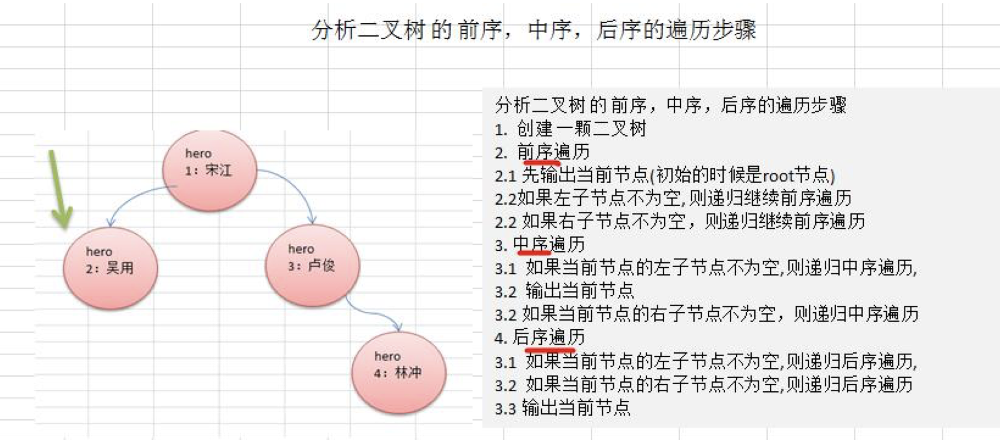

## 二叉树-查找指定节点

要求

1. 请编写前序查找，中序查找和后序查找的方法。

2. 并分别使用三种查找方式，查找 heroNO = 5 的节点

3. 并分析各种查找方式，分别比较了多少次

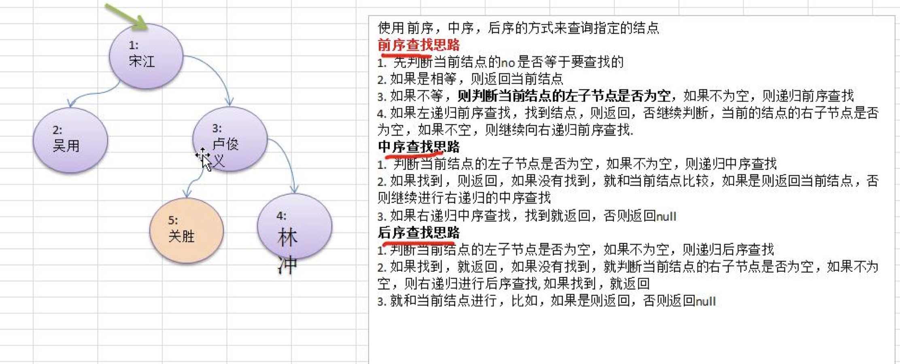

## 二叉树-删除节点

> 要求

1. 如果删除的节点是叶子节点，则删除该节点

2. 如果删除的节点是非叶子节点，则删除该子树.

3. 测试，删除掉 5 号叶子节点 和 3 号子树.

4. 完成删除思路分析.

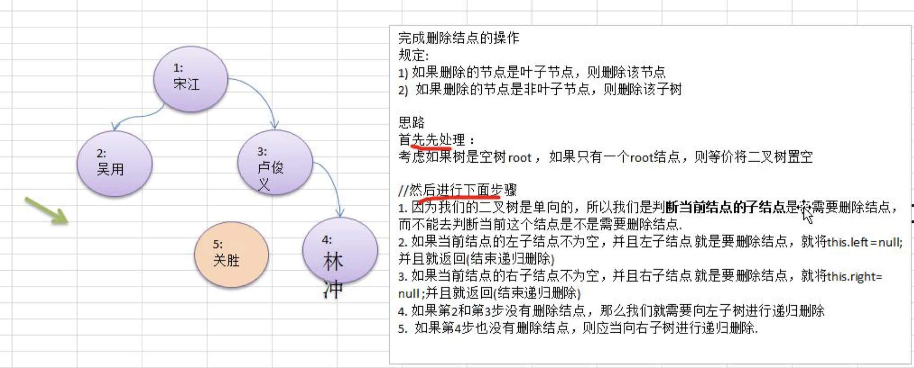

> 思考题(课后练习)
> 1. 如果要删除的节点是非叶子节点，现在我们不希望将该非叶子节点为根节点的子树删除，需要指定规则, 假如 规定如下:
> 2. 如果该非叶子节点 A 只有一个子节点 B， 则子节点 B 替代节点 A
> 3. 如果该非叶子节点 A 有左子节点 B 和右子节点 C， 则让左子节点 B 替代节点 A。

## 顺序存储二叉树
### 顺序存储二叉树的概念
> 基本说明
> 从数据存储来看，数组存储方式和树的存储方式可以相互转换，即数组可以转换成树，树也可以转换成数组， 看右面的示意图。

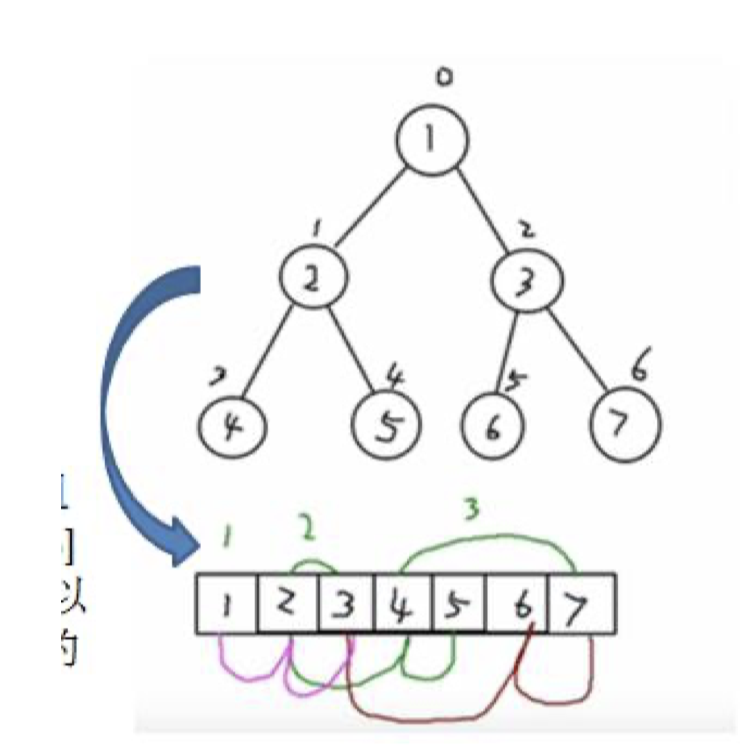
> 要求:

1. 右图的二叉树的结点，要求以数组的方式来存放 arr : [1, 2, 3, 4, 5, 6, 6]

2. 要求在遍历数组 arr 时，仍然可以以前序遍历，中序遍历和后序遍历的方式完成结点的遍历



### 顺序存储二叉树的特点:

1. 顺序二叉树通常只考虑完全二叉树

2. 第 n 个元素的左子节点为 2 * n + 1

3. 第 n 个元素的右子节点为 2 * n + 2

4. 第 n 个元素的父节点为 (n-1) / 2

5. n : 表示二叉树中的第几个元素(按 0 开始编号如图所示)

### 顺序存储二叉树遍历

需求: 给你一个数组 {1,2,3,4,5,6,7}， 要求以二叉树前序遍历的方式进行遍历。 前序遍历的结果应当为
1,2,4,5,3,6,7